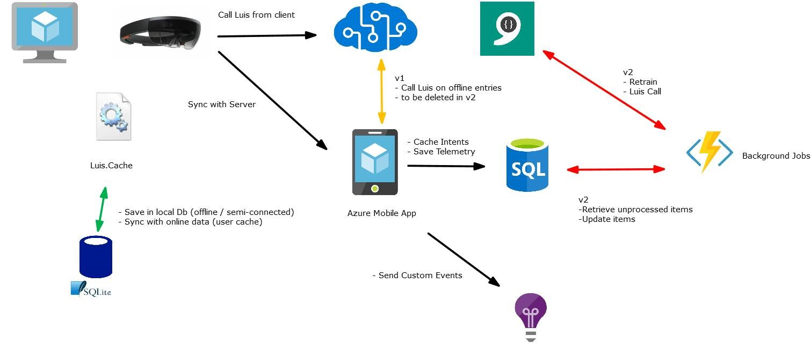

# LUIS Caching Service

**LUIS Caching Service** is a reusable sample that showcases how to cache results from the [Language Understanding Intelligent Service](https://www.luis.ai/home) (LUIS) in [Microsoft Cognitive Services](https://azure.microsoft.com/services/cognitive-services/). The goal is to help provide partial support for LUIS in voice-based applications running on mobile and [Mixed Reality](https://developer.microsoft.com/en-us/windows/mixed-reality/mixed_reality) devices in poor connectivity areas.

As users speak into the app, their voice commands are sent to LUIS to extract the user's intent and entities out of the utterances. Thesae results are then cached and timestamped locally in a SQLite database, ready to be queried when the same utterance is used. An added benefit of this solution is that it reduces roundtrips to the LUIS APIs in the cloud, accelerating the retrieval of results and reducing API costs since many users often use the same voice commands in apps used on a daily basis.

## Project History

This project was originally developed jointly by Microsoft and [Kognitiv Spark](http://kognitivspark.com/) in February 2018 as part of a 4-day **Mixed Reality + AI** hackfest at the Microsoft Campus in Redmond, WA. Kognitiv Spark's RemoteSpark platform is a holographic worker support solution that uses the power of [Mixed Reality](https://developer.microsoft.com/en-us/windows/mixed-reality/mixed_reality) for workplace remote support. Since these remote workers often work in areas with poor or no connectivity, their main device - [Microsoft HoloLens](https://www.microsoft.com/hololens) - is not guaranteed to be connected to the cloud. Remote Spark makes extensive use of voice commands in the HoloLens app, and Kognitiv Spark's team wanted to expand support to full Natural Language Processing, thanks to LUIS. Since LUIS requires constant connectivity to Azure Cognitive Services, this project was born to provide partial LUIS support even when disconnected.

The original contributors during the hackfest were:

* [David Murphy](https://github.com/davejmurphy), Mixed Reality Developer, Kognitiv Spark
* [Ryan Groom](https://twitter.com/ryangroom), CTO, Kognitiv Spark
* [David Coppet](https://twitter.com/davidcoppet), Azure App Consult Program Lead, Microsoft EMEA
* [Nick Landry](https://github.com/ActiveNick), Mixed Reality Software Engineer, Microsoft Commercial Software Engineering

## Solution Architecture

LUIS Caching Service includes the following components:

* **LUIS Cache Library**: [Universal Windows Platform](https://docs.microsoft.com/windows/uwp/) (UWP) DLL that handles all client-side operations, including making calls to the LUIS API, caching results in SQLite, querying the cache when a new request is made, gathering analytics, and synchronizing LUIS & analytics data with the LUIS Cache Server in Azure. Requires Windows 10 Anniversary Update or higher (1607, build 14393). 
* **LUIS Cache Server**: Web Service application built with ASP.NET Web API & C# and hosted in Azure App Service. This API app receives cache & analytics data from the LUIS Cache Library and provides sync services between SQLite on the device side and Azure SQL Database on the cloud side.
* **LUIS Cache Client**: Test client application for UWP built with XAML & C# used to test & demonstrate the features of the LUIS Caching Service. 

